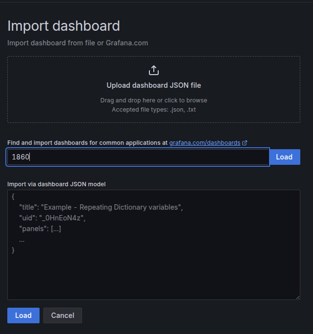
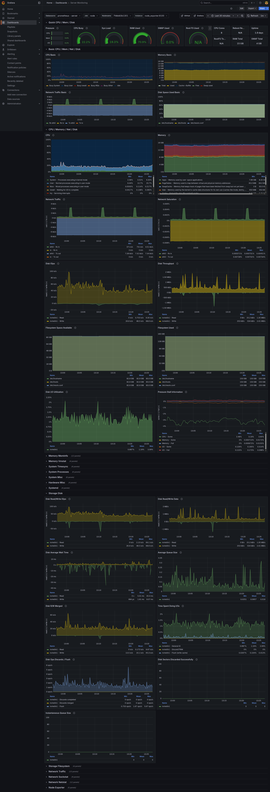

# Monitoring Stack with Prometheus & Grafana

This project sets up a monitoring stack using **Prometheus**, **Grafana**, and **Node Exporter**.

## 🚀 Services
- **Prometheus** → runs on port `9090`
- **Grafana** → runs on port `3000`
- **Node Exporter** → runs on port `9100`

## 🛠️ How to Run

Clone this repository and start the stack with Docker Compose:

```bash
docker-compose up -d
```


## 📈 Setup Grafana Dashboard
1. Visit Dashboard Template
Use the official Node Exporter Full dashboard (ID: 1860):
```bash
https://grafana.com/grafana/dashboards/1860-node-exporter-full/
```
2. Login to Grafana
Endpoint: 
```bash
http://localhost:3000/
```
Username: 
```bash 
admin
```
Password: 
```bash
P@ssw0rd123!!!
```

3. Add Prometheus as a Data Source
From the sidebar, go to Configuration → Data sources → Add new data source
Choose Prometheus
Configure:
Name: prometheus-server
Connection: http://prometheus:9090
Click Save & Test → make sure there are no errors.


4. Import Dashboard Template
Go to Dashboard → New → Import
Enter a name for your project.
Choose one of the following options:
Upload a JSON file
Paste Dashboard ID (1860)
Paste JSON directly


5. ✅ Result
If the configuration is successful, Grafana will display system metrics from Node Exporter:



